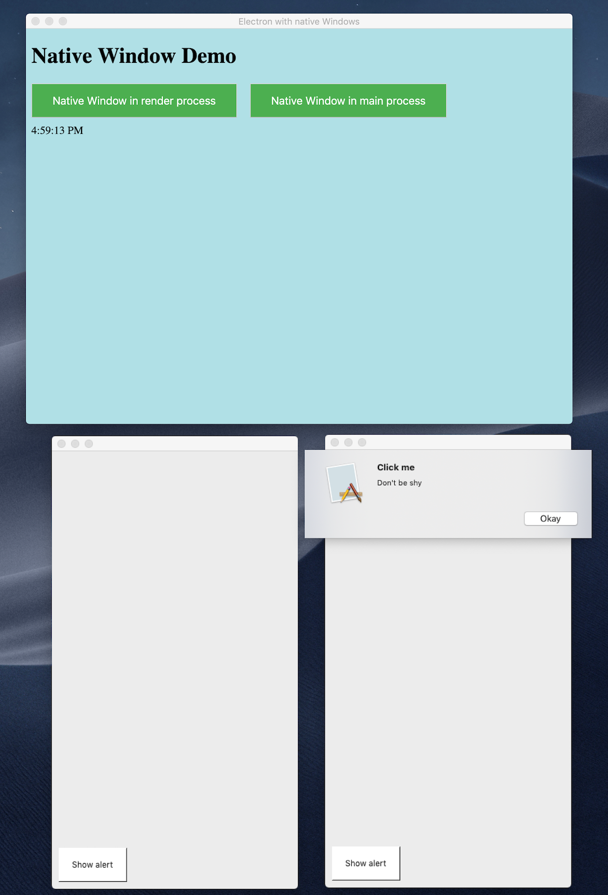

# electron-native-window

This is a super simple Electron example, demonstrating how to open native Windows on macOS and Windows from the main and the render process.
Based on: [https://github.com/electron/electron-quick-start](https://github.com/electron/electron-quick-start)

## Start

To clone and run this repository you'll need [Git](https://git-scm.com), [Node.js](https://nodejs.org/en/download/) (which comes with [npm](http://npmjs.com)) installed on your computer. 

From your command line:

```bash
# Clone this repository
git clone https://github.com/christophpurrer/electron-native-window.git
# Go into the repository
cd electron-native-window
# Install dependencies
npm install
# Run the app
npm start
```
This will run the application.

## Developer tooling
Open the Chrome developer tools to see relevant logging statements

For Xcode, run
```bash
yarn genxcode
```
This might only work with Python 2.7 and not with version 3.7

